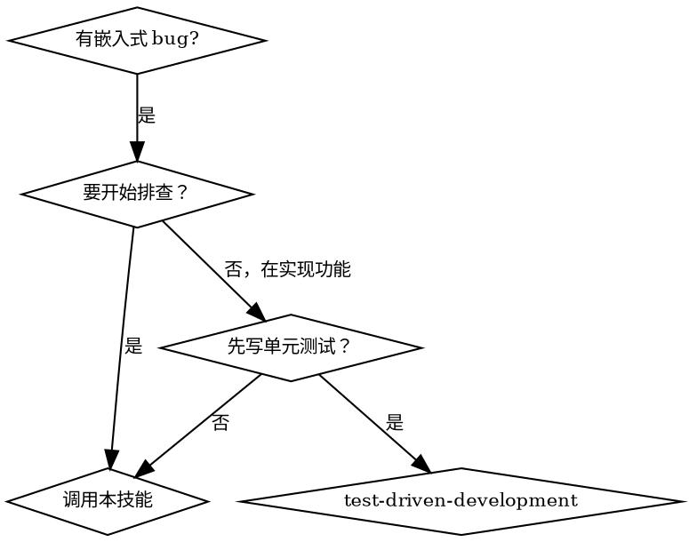

# 嵌入式调试第一性原理导航器

## 概述

基于**第一性原理 + 系统分层思维**，提供从现象到根因的结构化调试方案。通过**奥卡姆剃刀→证伪主义→迭代闭环**的执行流程，杜绝主观猜测和无效排查。

## 何时使用



**典型触发场景**：
- 通信协议异常（SPI/I2C/UART/CAN 丢包、时序错误、设备不响应）
- 外设驱动不工作（GPIO、ADC、DAC、Timer、PWM、I2S、SDIO）
- 系统级问题（死机、重启、功耗异常、启动失败）
- 中断问题（不触发、重复触发、优先级冲突）
- RTOS 问题（任务不执行、死锁、栈溢出）
- 传感器/执行器通信失败

**不适用**：
- 实现新功能 → 使用 `superpowers:test-driven-development`
- 代码审查 → 使用 `superpowers:requesting-code-review`

## 核心原则

**违反这些原则意味着：停止排查，重新开始。**

| 原则 | 违反表现 | 正确做法 |
|------|---------|---------|
| **第一性原理** | "我觉得驱动有问题"、"可能是芯片坏了" | 回归客观事实：引脚电平、寄存器值、中断状态、日志 |
| **系统分层** | 眉毛胡子一把抓，同时查硬件和代码 | 按层级排查，明确每层的输入输出边界 |
| **奥卡姆剃刀** | 一上来就分析复杂代码逻辑 | 先验证成本最低的假设（接线→配置→驱动→协议） |
| **证伪主义** | 只找支持自己猜测的证据 | 设计证伪实验，逐个排除假设 |
| **迭代闭环** | 一次改多处代码然后测试 | 每次只改一个变量，立即验证并记录 |

---

## 红线 - 停下来重新开始

**出现以下任何一条，意味着：删除当前排查思路，从步骤 1 重新开始。**

| 红线行为 | 典型表现 | 正确动作 |
|---------|---------|---------|
| **跳过事实收集** | "根据经验，这通常是..."、"我直接给你方案" | 回到步骤 1，填写事实清单 |
| **主观猜测根因** | "应该是硬件问题"、"驱动可能有 bug" | 追问："你测量过哪些引脚？结果是什么？" |
| **跨层级排查** | "你可以同时检查接线和代码" | 严格按层级顺序，完成一层再进下一层 |
| **未排序假设** | "看看驱动初始化逻辑"（先查复杂代码） | 先验证成本最低的假设 |
| **证实偏误** | "你试试这个，应该能解决" | 设计证伪实验：如何证明这个假设是错的？ |
| **一次改多处** | "把这几处都改了再测" | 回到步骤 5，每次只改一个变量 |
| **无工具硬猜时序** | 没有示波器却分析建立/保持时间 | 用寄存器读值、日志、仿真替代 |
| **忽略权威压力** | "资深工程师说没问题，那就是..." | 回归事实：寄存器值是多少？ |
| **迎合时间压力** | "产线等着，我直接给个最快方案" | 最慢的方案是跳过步骤导致返工 |

**违反规则的字面意思就是违反规则的精神。**

---

## 合理化借口表

**这是智能体在压力下可能使用的合理化借口，每条都有明确的反驳。**

| 借口 | 现实 | 反驳 |
|------|------|------|
| "这个情况很明显，不需要事实清单" | 明显的問題往往有隐蔽的根因 | 再明显的问题也要事实支撑 |
| "我已经手动测试过了" | 手动测试≠客观事实 | 请提供测量数据：电压值、寄存器值 |
| "后写事实清单效果一样" | 后补事实=先入为主 | 事实清单必须在猜测之前 |
| "这层排查过了，没问题" | 未经证伪的排查=没排查 | 请提供证伪证据：测量值/寄存器读数 |
| "这个假设概率最高，先查它" | 概率高≠验证成本低 | 按验证成本排序，不是概率 |
| "一起查更快" | 同时查多处=无法定位根因 | 一次只查一个变量 |
| "用户说没问题，那应该没问题" | 用户判断≠客观事实 | 回归测量数据 |
| "这个技能太繁琐了" | 繁琐是 disciplined 的代价 | 繁琐比返工快 |
| "我有信心是这个原因" | 信心≠证据 | 请提供证伪证据 |
| "时间紧迫，跳过这一步" | 跳过步骤=增加返工风险 | 越紧迫越要按流程 |
| "这个问题不同，因为..." | 每个问题都有"不同"的表象 | 根因定位的底层逻辑相同 |

## 执行流程

### 步骤 0：场景分类（首要）

**在开始调试之前，先确认问题属于哪类场景。**

**动作**：与用户确认以下信息：

#### 1. 问题类型

| 类别 | 包含内容 |
|------|---------|
| **通信协议** | SPI、I2C/TWI、UART、CAN、Ethernet、I2S、I3C、QSPI、OSPI |
| **基础外设** | GPIO、ADC、DAC、Timer、PWM、WDT、RTC |
| **系统级** | 启动、时钟、电源、复位、低功耗、DMA |
| **中断** | NVIC、EXTI、中断优先级、中断服务程序 |
| **RTOS** | 任务、信号量、互斥锁、消息队列、事件标志 |
| **存储接口** | SDIO、eMMC、NAND、NOR Flash |

#### 2. 可用工具

- 逻辑分析仪
- 示波器
- 万用表
- JTAG/SWD 调试器
- 仅有串口日志
- 纯仿真/寄存器分析（无硬件）

#### 3. 目标平台

- MCU 型号（STM32F103、ESP32、QPG6200 等）
- 是否有开发板/实体硬件
- 操作系统/RTOS（FreeRTOS、RT-Thread、无 OS）
- 项目代码路径（如有，技能会动态读取学习）

**输出**：场景分类确认，后续排查将基于此分类定制层级和假设。

---

### 步骤 1：问题锚定（过滤主观假设）

**目的**：剥离"我觉得"类主观猜测，只保留不可辩驳的客观事实。

**动作**：输出事实收集清单，要求用户填写：

```
【事实收集清单】请提供以下信息：

□ 问题现象：具体表现是什么？
  （如：MOSI 引脚无波形、RX 中断不触发、电流 50mA 而非 5mA、从设备无 ACK）

□ 复现条件：如何稳定复现？
  （如上电后首次通信必现、连续运行 10 分钟后偶发、特定数据长度时失败）

□ 已测量数据：
  - 关键引脚电平：____（如：SCL 3.3V、SDA 0V、VCC 3.28V）
  - 关键寄存器值：____（如：CR1=0x0005、SR1=0x0002）
  - 电流/功耗：____

□ 已抓取的波形/日志（如有）

□ 已尝试过的排查动作及结果：____
```

**红线**：用户回答中包含主观猜测时，必须追问客观数据。

示例：
- 用户："应该是硬件问题" → 追问："你测量过哪些引脚？结果是什么？"
- 用户："驱动可能有问题" → 追问："哪个寄存器的值与预期不符？"

---

### 步骤 2：系统分层（划定排查边界）

**目的**：将问题对应的系统拆解为清晰层级，明确排查优先级。

**通用分层架构**（从底层到上层）：

```
┌─────────────────────────────────────────────────────────┐
│ Level 5: 应用层 / RTOS                                   │
│ • 应用业务逻辑、RTOS 任务调度、优先级、同步机制            │
│ 输入：来自协议层的数据 / 事件                              │
│ 输出：业务行为（控制执行器、发送数据等）                  │
├─────────────────────────────────────────────────────────┤
│ Level 4: 协议适配层                                      │
│ • 通信协议状态机（SPI/I2C/UART 等）                       │
│ • 数据打包/解包、校验                                   │
│ 输入：来自驱动层的原始数据                                │
│ 输出：结构化数据帧                                      │
├─────────────────────────────────────────────────────────┤
│ Level 3: 驱动封装层                                      │
│ • HAL 层驱动函数、BSP 封装、引脚映射、外设句柄            │
│ 输入：寄存器配置参数                                    │
│ 输出：读写数据的 API                                     │
├─────────────────────────────────────────────────────────┤
│ Level 2: 寄存器配置层                                    │
│ • 时钟使能、外设寄存器位配置、中断向量表、优先级配置      │
│ 输入：硬件抽象配置结构体                                 │
│ 输出：寄存器写操作                                      │
├─────────────────────────────────────────────────────────┤
│ Level 1: 硬件物理层                                      │
│ • 接线、电源、晶振、复位电路、示波器/万用表可测量的物理量  │
│ 输入：无（物理存在）                                    │
│ 输出：电信号（电压、电流、波形）                         │
└─────────────────────────────────────────────────────────┘
```

**排查优先级顺序**：
1. **硬件物理层** → 2. **寄存器配置层** → 3. **驱动封装层** → 4. **协议适配层** → 5. **应用层**

**例外**：如确认无硬件工具，跳至纯软件排查（从寄存器/驱动层开始）。

**动态学习**：如项目代码可用，技能会用 Grep/Glob 读取相关代码来定制层级检查点。

---

### 步骤 3：生成假设（奥卡姆剃刀排序）

**目的**：针对每个层级，生成"验证成本最低、假设最少"的排查假设。

**排序规则**（优先级从高到低）：
1. **验证成本最低**（目视检查 → 万用表 → 示波器 → 代码分析）
2. **概率最高**（根据经验最常见的问题）
3. **可证伪性最强**（最容易排除或确认）

**输出格式**：按层级输出假设清单，每个假设标注验证成本。

#### 常见协议/外设的 Top 假设参考

**I2C/TWI 设备不响应**：

| 层级 | 假设 | 验证成本 |
|------|------|---------|
| Level 1 | 接线错误或接触不良 | 目视/万用表（最低） |
| Level 1 | 缺少上拉电阻或阻值错误 | 万用表（低） |
| Level 1 | 从设备电源异常 | 万用表（低） |
| Level 2 | I2C 时钟未使能 | 读寄存器（低） |
| Level 2 | 引脚复用配置错误 | 读寄存器/查代码（中） |
| Level 2 | 从设备地址错误（7 位 vs 8 位） | 查代码/ datasheet（中） |
| Level 3 | 驱动初始化顺序错误 | 查代码（中） |
| Level 4 | 时序参数不匹配（频率过高） | 示波器/代码（高） |
| Level 4 | 时钟拉伸（clock stretching）未处理 | 示波器/代码（高） |

**SPI 通信失败**：

| 层级 | 假设 | 验证成本 |
|------|------|---------|
| Level 1 | 接线错误（MOSI/MISO 接反） | 目视（最低） |
| Level 1 | 片选引脚电平异常 | 万用表（低） |
| Level 2 | SPI 时钟未使能 | 读寄存器（低） |
| Level 2 | 时钟极性/相位（CPOL/CPHA）配置错误 | 读寄存器（低） |
| Level 3 | 片选 GPIO 未配置为输出 | 查代码（中） |
| Level 4 | 时序不匹配（MSB/LSB 优先） | 示波器（高） |

**UART 丢包/乱码**：

| 层级 | 假设 | 验证成本 |
|------|------|---------|
| Level 1 | TX/RX 接反 | 目视（最低） |
| Level 1 | 共地问题 | 万用表（低） |
| Level 2 | 波特率误差过大 | 读寄存器/计算（低） |
| Level 2 | 中断优先级过低 | 读寄存器（中） |
| Level 3 | RX FIFO 溢出未处理 | 查代码（中） |
| Level 5 | 任务调度延迟导致数据丢失 | 日志/分析（高） |

**系统死机/重启**：

| 层级 | 假设 | 验证成本 |
|------|------|---------|
| Level 1 | 电源不稳定 | 示波器（中） |
| Level 2 | 看门狗未喂 | 查代码（中） |
| Level 5 | 栈溢出 | 查代码/增加检测（中） |
| Level 5 | 中断死锁 | 日志/分析（高） |
| Level 5 | 访问非法内存地址 | 调试器/日志（高） |

**GPIO 不工作**：

| 层级 | 假设 | 验证成本 |
|------|------|---------|
| Level 1 | 引脚接线错误 | 目视（最低） |
| Level 2 | 时钟未使能 | 读寄存器（低） |
| Level 2 | 引脚复用功能配置错误 | 读寄存器（低） |
| Level 2 | 上下拉配置错误 | 读寄存器/万用表（中） |
| Level 3 | GPIO 模式配置错误（输入/输出/开漏） | 查代码（中） |

---

### 步骤 4：证伪验证（逐个排除）

**目的**：针对每个假设设计证伪实验，通过排除法锁定问题范围。

**关键原则**：
- 每一步只验证一个变量
- 设计证伪实验（排除假设），而非证实实验
- 记录每一步的结果（通过/失败）

**输出格式**：

```
【证伪实验 #1 - 验证 H1：接线错误】
动作：重新插拔接线，用万用表蜂鸣档测量连通性
预期：如果接线正常，所有关键网络连通
实际结果：____
结论：□ 排除 H1  □ H1 仍可能，需进一步检查
```

**常见证伪实验设计**：

| 假设 | 证伪实验 | 排除标准 |
|------|---------|---------|
| 接线错误 | 万用表蜂鸣档测量 | 所有关键网络阻值<1Ω |
| 上拉电阻缺失 | 测量 SDA/SCL 对地阻抗 | 断电时应为 kΩ级别 |
| 时钟未使能 | 读取 RCC 寄存器 | 对应位应为 1 |
| 地址错误 | 发送 0x00 地址测试 | 如有 ACK 则是地址配置问题 |
| 时序不匹配 | 逻辑分析仪抓取波形 | 波形与预期时序对比 |

---

### 步骤 5：最小闭环（迭代定位）

**目的**：锁定问题范围后，搭建最小可复现环境，精准定位根因。

**动作**：
1. 剥离无关代码和外设
2. 创建最小测试工程（仅保留问题相关代码）
3. 每次只修改一处代码/配置
4. 立即验证并记录结果

**输出**：

```
【最小闭环测试】
已剥离：____（与问题无关的代码/外设）
保留核心：____（问题相关的最小代码集）

迭代 #1：
修改：____
结果：____

迭代 #2：
修改：____
结果：____
```

---

### 步骤 6：根因复盘（原理回归）

**目的**：回归底层原理，解释问题发生的本质原因，输出修复方案和同类问题规避方法。

**输出格式**：

```
【根因分析】
根本原因：____（用硬件/软件原理解释）
修复方案：____
同类问题规避：____
```

---

## 快速参考表

| 问题类型 | 重点排查层级 | 常见假设 Top 3 |
|---------|------------|---------------|
| I2C/TWI | Level 1→2→4 | 接线/上拉、地址配置、时序参数 |
| SPI | Level 1→2→3 | 接线错误、CPOL/CPHA、片选配置 |
| UART | Level 1→2→5 | TX/RX 接反、波特率误差、FIFO 溢出 |
| GPIO | Level 1→2→3 | 接线错误、时钟未使能、模式配置 |
| 系统死机 | Level 5→2→1 | 栈溢出、看门狗、电源不稳定 |
| 中断不触发 | Level 2→3 | NVIC 未使能、优先级配置、标志未清 |
| 功耗异常 | Level 1→5 | 外设未关闭、GPIO 浮空、任务未阻塞 |

---

## 常见错误

| 错误 | 表现 | 修正 |
|------|------|------|
| 跳过事实收集 | 直接开始猜测根因 | 回到步骤 1，填写事实清单 |
| 跨层级排查 | 同时查硬件和代码 | 严格按层级顺序，完成一层再进入下一层 |
| 证实偏误 | 只找支持猜测的证据 | 设计证伪实验：如何证明这个假设是错的？ |
| 一次改多处 | 修改多个变量后测试 | 回到步骤 5，每次只改一处 |
| 无工具硬猜 | 没有示波器却分析时序问题 | 用寄存器读值、日志、仿真替代 |

---

## 特殊场景处理

### 无硬件工具场景

如确认无逻辑分析仪/示波器：
- 用寄存器读值替代波形测量
- 用 GPIO 翻转 + 串口时间戳替代时序分析
- 用软件仿真/在线调试器替代物理测量

### 偶发问题场景

- 增加日志密度，捕获问题前后上下文
- 使用断言（assert）在关键路径
- 延长测试时间，建立问题发生统计模型

### 无源码场景（第三方库/闭源组件）

- 聚焦输入输出边界测试
- 用黑盒方式验证接口行为
- 隔离问题组件，替换/绕过验证

### 动态项目学习

如用户提供项目代码路径，技能会：
1. 用 Grep 搜索相关驱动代码
2. 用 Glob 查找配置文件/链接脚本
3. 读取寄存器定义头文件
4. 定制检查点基于实际代码结构

示例（QPG6200 TWI 问题）：
```
技能动作：
1. Grep "qDrvTWIM_Init" → 读取初始化代码
2. Grep "qRegTWIM_" → 读取寄存器定义
3. Glob "qPinCfg*.h" → 读取引脚配置
4. 定制 Level 2/3 检查点基于实际代码
```

---

## 附录：协议检查清单模板

### I2C/TWI 检查清单

```
□ Level 1 硬件
  □ SDA/SCL 接线正确
  □ 上拉电阻存在且阻值正确（1.5kΩ-10kΩ）
  □ 从设备电源正常（测量 VCC）
  □ 共地良好

□ Level 2 寄存器
  □ I2C 时钟使能
  □ 引脚复用配置正确
  □ 频率配置（预分频值）
  □ 从设备地址（7 位左移 vs 8 位）

□ Level 3 驱动
  □ 初始化顺序正确
  □ 中断使能
  □ 回调函数注册

□ Level 4 协议
  □ START 条件正确
  □ 地址 + 读/写位
  □ ACK/NACK 处理
  □ STOP 条件
```

### SPI 检查清单

```
□ Level 1 硬件
  □ MOSI/MISO/CLK/CS 接线正确
  □ 片选电平正确（主动低/高）
  □ 从设备电源正常

□ Level 2 寄存器
  □ SPI 时钟使能
  □ CPOL/CPHA 配置
  □ MSB/LSB 优先
  □ 波特率预分频

□ Level 3 驱动
  □ 片选 GPIO 配置为输出
  □ 片选时序正确（提前/延迟）

□ Level 4 协议
  □ 时钟极性正确
  □ 数据采样边沿正确
```

### UART 检查清单

```
□ Level 1 硬件
  □ TX 接 RX、RX 接 TX
  □ 共地良好
  □ 电平匹配（3.3V/5V）

□ Level 2 寄存器
  □ UART 时钟使能
  □ 波特率配置（误差<2%）
  □ 数据位/停止位/校验位

□ Level 3 驱动
  □ 中断优先级
  □ FIFO 阈值配置
  □ DMA 配置（如使用）

□ Level 5 应用
  □ 缓冲区大小足够
  □ 处理及时性（无阻塞）
```
